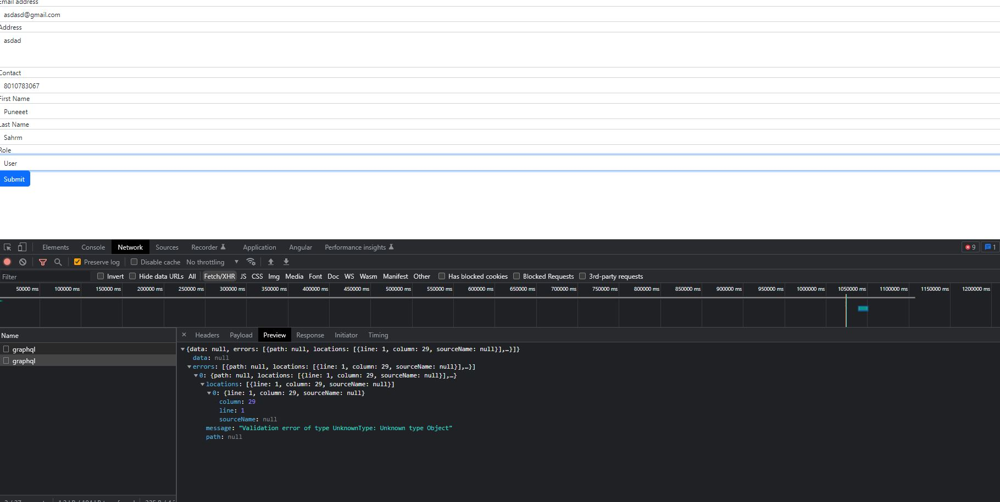

# AuthApp

This project was generated with [Angular CLI](https://github.com/angular/angular-cli) version 16.0.3.

## Development server

Run `ng serve` for a dev server. Navigate to `http://localhost:4200/`. The application will automatically reload if you change any of the source files.

## Register Page

## Graphql Module Configuration

auth-app\src\app\graphql.module.ts

## API Service & Mutations

auth-app\src\app\operations\mutation.ts
auth-app\src\app\api.service.ts

